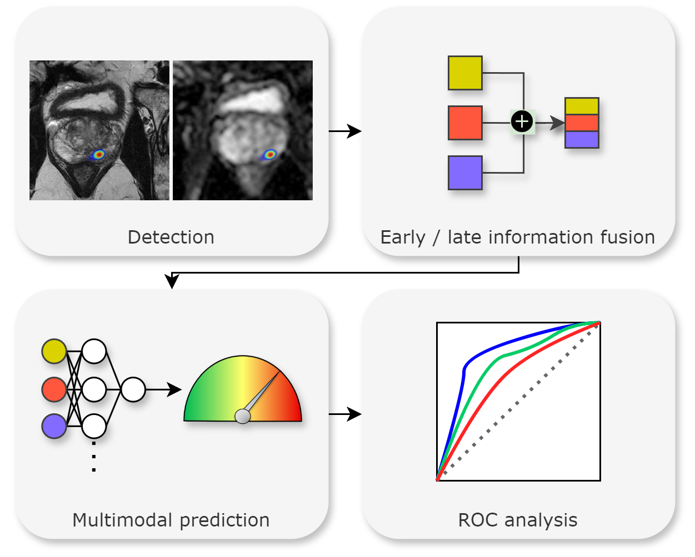

# Multimodal AI Combining Clinical and Imaging Inputs Improves Prostate Cancer Detection
Project code for "Multimodal AI Combining Clinical and Imaging Inputs Improves Prostate Cancer Detection"



## Usage
### 1. Generate detection heatmaps DL detection model
This project used a U-Net csPCa detection model pretrained in 7000+ cases ([Bosma et al., 2023](https://doi.org/10.1148/ryai.230031)). 
The algorithm is available from: [GrandChallenge](https://grand-challenge.org/algorithms/bpmri-cspca-detection-report-guided-annotations/)

Alternatively, any other lesion detection algorithm that generates heatmap predictions for input scans.

Generate heatmaps for all your scans, and save them as a `.nii.gz` file to `./heatmaps/`

### 2. Extract lesions / volumes / likelihoods
Run the following code to apply dynamic thresholding and extract up to three lesion candidates. 

```
python extract_lesions.py
```

Lesion volumes and likelihood scores will be saved to `lesions.csv`

### 3. Merge your data with clinical parameters
Use the scan ID to merge your data with additional (clinical) parameters to create the multimodal datasets.
An example is provided in `merge_data.py`, combining the predictions with PSA, prostate volume, and age.

### 4. Generate predictions for different configurations
Modify lines X-Y in `experiment.py` to specify your own data groupings. The groupings will be relevant in early- (feature level) versus late (decision level) fusion.

Run:
```
python experiment.py [configuration] [fusion]
e.g.
python experiment.py baseline early
```

To run the experiment for a given configuration.

If `DO_OPTIMIZATION` is set to `True`, optuna will automatically optimize the model algorithm and hyperparameters by repeatedly performing cross-validation on the development dataset (default: 100 trials, 25 startup (random) trials, 5 inner CV folds).
The optimized hyperparameters are then reloaded and applied to internal and external testing datasets.

If `DO_OPTIMIZATION` is set to `False`, optuna is not called, and hyperparameters are loaded from `BEST_PARAMS`.

The `Classifier` class is used in the code to enable extensive hyperoptimization of both algorithm and parameters.

Implemented algorithms include `"linear_svm", "rbf_svm", "dec_tree", "grad_boost", "mlp", "logistic"`.

New algorithms can be implemented by specifying their class name, search space and fixed parameters in `Classifier._set_model_type(..)`

Example:
```python
elif classifier_type == "rbf_svm":
  self._inst_func = SVC     # <-- Class name used to create an instance of the class
  self._search_space = [  # <--- Search space for hyperparameter optimization (see optuna documentation)
      ("rbf_C", "float", 0.1, 2.0),
      ("rbf_class_weight", "choice", [None, "balanced"]),
      ("rbf_gamma", "choice", ["scale", "auto"]),
  ]
  self.fixed_params = {"fx_kernel": "rbf", "fx_probability": True}  # <--- Additional fixed model parameters (not optimized)
```

Note that the prefix `rbc_` in the above example is stripped before passing to the model, but is necessary to make the parameter names unique from those for other model types during hyperoptimization.

---

The results of the experiments are saved to a folder `csv_results/`.

### 5. Analyse the data
We used R to analyse the difference between unimodal and multimodal models.
The statistical code is included in `statistics.R`. 

Requirements:
```

```

ROC curves are generated and saved to the default R workdir `~/`.
